# 🎬 Netflix Azure Data Engineering Pipeline
### End-to-End Medallion Architecture | ADF + Databricks + Lakeflow Spark Declarative Pipelines + Unity Catalog

---


---

## 📌 Project Overview

This project is a **production-grade, end-to-end Azure Data Engineering pipeline** built on the **Medallion Architecture (Bronze → Silver → Gold)**. It processes Netflix movies and TV shows data through multiple transformation layers using the latest Azure data engineering tools and best practices used in real-world enterprise environments.

The pipeline is **fully parameterized and dynamic** — no hardcoded values, no static notebooks. Every component is built the way it would be built inside a real company.

> ⚡ Built for interview preparation and real-world skill demonstration in 2026.

---

## ⚠️ Important — Databricks Terminology Updated in 2026

> This project uses the **latest Databricks UI and product names as of early 2026**.
> If you are following older tutorials, be aware of these rebranding changes:

| Old Name (2024 and before) | New Name (2026) | Where to find it |
|---------------------------|-----------------|-----------------|
| Delta Live Tables (DLT) | Lakeflow Spark Declarative Pipelines (SDP) | Jobs & Pipelines → ETL pipeline |
| Databricks Workflows | Jobs & Pipelines | Left sidebar |
| Workflow | Job | Jobs & Pipelines tab |
| DLT Pipeline | ETL Pipeline | Jobs & Pipelines → Create new |
| Delta Live Tables tab | Gone — merged into Jobs & Pipelines | Jobs & Pipelines → Pipelines filter |

> The `import dlt` syntax and `@dlt.table` decorators still work — **no code changes needed**. Only the UI and product names changed.

---

## 🏗️ Architecture

```
┌─────────────────────────────────────────────────────────────────┐
│                        DATA SOURCES                             │
│                                                                 │
│   GitHub Repository (CSV files)    ADLS Gen2 Raw Container      │
│   └── directors.csv                └── netflix_titles.csv       │
│   └── cast.csv                                                  │
│   └── countries.csv                                             │
│   └── category.csv                                              │
└──────────────────────┬──────────────────────────────────────────┘
                       │
                       ▼
┌─────────────────────────────────────────────────────────────────┐
│              INGESTION LAYER — Azure Data Factory               │
│                                                                 │
│   ✅ Parameterized ForEach Pipeline                             │
│   ✅ Data Validation (file existence check before running)      │
│   ✅ Dynamic Copy Activity (GitHub → Bronze)                    │
│   ✅ Parallel execution for speed                               │
│   ✅ Retry policies and error handling                          │
│   ✅ Web Activity for GitHub metadata fetch                     │
└──────────────────────┬──────────────────────────────────────────┘
                       │
                       ▼
┌─────────────────────────────────────────────────────────────────┐
│              BRONZE LAYER — ADLS Gen2 + Auto Loader             │
│                                                                 │
│   ✅ Raw data stored as-is (no transformation)                  │
│   ✅ Databricks Auto Loader for incremental ingestion           │
│   ✅ Exactly-once semantics via RocksDB checkpointing           │
│   ✅ Schema inference and schema evolution handling             │
│   ✅ Explicit checkpoint paths (Unity Catalog requirement)      │
│   ✅ Delta format storage                                       │
└──────────────────────┬──────────────────────────────────────────┘
                       │
                       ▼
┌─────────────────────────────────────────────────────────────────┐
│       SILVER LAYER — Databricks + PySpark + Jobs & Pipelines    │
│                                                                 │
│   ✅ Null handling with fillna() and column-specific values     │
│   ✅ Data type casting with withColumn() + cast()               │
│   ✅ String extraction using split() function                   │
│   ✅ Conditional columns using when().otherwise()               │
│   ✅ Window functions — dense_rank() for ranking                │
│   ✅ Aggregations with groupBy() and agg()                      │
│   ✅ Parameterized notebooks using dbutils.widgets              │
│   ✅ Dynamic orchestration via Jobs & Pipelines ForEach loop    │
│   ✅ Task value passing via dbutils.jobs.taskValues             │
│   ✅ Data visualization — bar charts and pie charts             │
└──────────────────────┬──────────────────────────────────────────┘
                       │
                       ▼
┌─────────────────────────────────────────────────────────────────┐
│  GOLD LAYER — Lakeflow Spark Declarative Pipelines (ETL Pipeline)│
│                                                                 │
│   ✅ Declarative ETL using @dlt.table decorators               │
│   ✅ Data quality expectations (expect_all_or_drop)            │
│   ✅ Streaming tables + Materialized views                      │
│   ✅ Full lineage tracking in Unity Catalog                     │
│   ✅ Incremental processing — zero recompute on reruns          │
│   ✅ Automatic schema enforcement                               │
│   ✅ Bad records dropped automatically by quality rules         │
└──────────────────────┬──────────────────────────────────────────┘
                       │
                       ▼
┌─────────────────────────────────────────────────────────────────┐
│                    SERVING LAYER                                 │
│                                                                 │
│   Power BI ←── Databricks SQL Endpoint (Partner Connect)        │
│   Azure Synapse Analytics (optional warehouse layer)            │
└─────────────────────────────────────────────────────────────────┘
```

---

## 🛠️ Tech Stack

| Category | Technology |
|----------|-----------|
| Cloud Platform | Microsoft Azure |
| Orchestration | Azure Data Factory (ADF) |
| Storage | Azure Data Lake Storage Gen2 (ADLS Gen2) |
| Compute & Processing | Azure Databricks |
| Incremental Ingestion | Databricks Auto Loader |
| Transformation | PySpark (Python) |
| Job Orchestration | Databricks Jobs & Pipelines |
| Gold Layer ETL | Lakeflow Spark Declarative Pipelines (formerly Delta Live Tables) |
| Data Governance | Unity Catalog |
| Table Format | Delta Lake |
| Data Quality | Lakeflow SDP Expectations |
| Reporting | Power BI |
| Language | Python, PySpark, SQL |

---

## 📂 Dataset

**Source:** Netflix Movies and TV Shows dataset
**Origin:** Kaggle / public GitHub repository
**Format:** CSV files

| File | Description | Layer |
|------|-------------|-------|
| `netflix_titles.csv` | Master data — show ID, title, type, release year, rating, description | Bronze → Silver → Gold |
| `directors.csv` | Lookup table — show ID to director mapping | Bronze → Silver → Gold |
| `cast.csv` | Lookup table — show ID to cast mapping | Bronze → Silver → Gold |
| `countries.csv` | Lookup table — show ID to country mapping | Bronze → Silver → Gold |
| `category.csv` | Lookup table — show ID to category mapping | Bronze → Silver → Gold |

---

## 🏛️ Azure Infrastructure

| Resource | Name | Purpose |
|----------|------|---------|
| Resource Group | `rg-netflix-de` | Container for all project resources |
| Storage Account | `netflixonkarstorage` | ADLS Gen2 with hierarchical namespace enabled |
| Container — Raw | `raw` | Landing zone for netflix_titles.csv |
| Container — Bronze | `bronze` | Raw ingested data from GitHub via ADF |
| Container — Silver | `silver` | Transformed Delta tables |
| Container — Gold | `gold` | Lakeflow SDP output tables managed by Unity Catalog |
| ADF Instance | `adf-netflix` | Pipeline orchestration |
| Databricks Workspace | `databricksnetflix` | All notebooks, jobs, ETL pipelines |
| Unity Catalog | `netflix_catalog` | Data governance and table management |
| Access Connector | `access-netflix` | Secure Databricks → ADLS Gen2 managed identity |

---

## 📁 Repository Structure

```
azure-netflix-data-engineering/
│
├── README.md
│
├── architecture/
│   └── architecture_diagram.png
│
├── databricks_notebooks/
│   ├── 1_autoloader_bronze.py        # Auto Loader streaming ingestion to Bronze
│   ├── 2_silver_lookup.py            # Lookup — builds array, exposes via task values
│   ├── 3_silver_transformation.py    # PySpark transformations on master data
│   └── 4_dlt_gold.py                 # Lakeflow Spark Declarative Pipelines — Gold layer
│
├── screenshots/
│   ├── 01_resource_group.png
│   ├── 02_adls_containers.png
│   ├── 03_bronze_delta_folders.png
│   ├── 04_silver_delta_folders.png
│   ├── 05_gold_delta_folders.png
│   ├── 06_adf_pipeline_canvas.png
│   ├── 07_adf_pipeline_runs.png
│   ├── 08_adf_linked_services.png
│   ├── 09_autoloader_notebook.png
│   ├── 10_silver_notebook_pyspark.png
│   ├── 11_silver_visualization.png
│   ├── 12_dlt_gold_notebook.png
│   ├── 13_gold_catalog_tables.png
│   ├── 14_dlt_pipeline_run.png
│   └── 15_pipeline_tables_expectations.png
│
├── videos/
│   ├── adf_live_pipeline_run.mp4
│   ├── dlt_lineage_graph_zoom.mp4
│   └── sql_netflix_data_query.mp4
│
└── docs/
    └── project_walkthrough.md
```

---

## 🔄 Pipeline Breakdown

### Layer 1 — Bronze (ADF Ingestion + Auto Loader)

**File:** `databricks_notebooks/1_autoloader_bronze.py`

The ADF pipeline ingests 4 CSV lookup files from GitHub into the Bronze container:

- **Parameterized datasets** — file name passed dynamically, no hardcoding
- **ForEach activity** — iterates over array of file/folder dictionaries in parallel
- **Validation pipeline** — checks `netflix_titles.csv` exists in Raw before running
- **Array parameter** — stores file mappings at pipeline level, no JSON file dependency

```python
# ADF ForEach array parameter
[
    {"folderName": "netflix_directors", "fileName": "directors.csv"},
    {"folderName": "netflix_cast",      "fileName": "cast.csv"},
    {"folderName": "netflix_countries", "fileName": "countries.csv"},
    {"folderName": "netflix_category",  "fileName": "category.csv"}
]
```

Auto Loader handles `netflix_titles.csv` incrementally:

```python
checkpoint_location = "abfss://silver@netflixonkarstorage.dfs.core.windows.net/checkpoint"

df = (spark.readStream
      .format("cloudFiles")
      .option("cloudFiles.format", "csv")
      .option("cloudFiles.schemaLocation", f"{checkpoint_location}/schema")
      .load("abfss://raw@netflixonkarstorage.dfs.core.windows.net/"))

(df.writeStream
   .format("delta")
   .option("checkpointLocation", f"{checkpoint_location}/titles")
   .outputMode("append")
   .trigger(processingTime="10 seconds")
   .start("abfss://bronze@netflixonkarstorage.dfs.core.windows.net/netflix_titles"))
```

---

### Layer 2 — Silver (PySpark Transformations)

**File:** `databricks_notebooks/3_silver_transformation.py`

Fully parameterized notebook driven by **Databricks Jobs & Pipelines** ForEach loop:

```python
# Widget parameters — fed dynamically by job
dbutils.widgets.text("source_folder", "netflix_titles")
dbutils.widgets.text("target_folder", "netflix_titles")
dbutils.widgets.text("fileformat", "delta")

v_source_folder = dbutils.widgets.get("source_folder")
v_target_folder = dbutils.widgets.get("target_folder")
v_fileformat    = dbutils.widgets.get("fileformat")
```

**Transformations applied:**

```python
from pyspark.sql.functions import *
from pyspark.sql.window import Window

# 1. Null handling — different values per column
df = df.fillna({"duration_minutes": 0, "duration_seasons": 1})

# 2. Data type casting
df = (df.withColumn("duration_minutes", col("duration_minutes").cast(IntegerType()))
        .withColumn("duration_seasons", col("duration_seasons").cast(IntegerType())))

# 3. String extraction — title before colon separator
df = df.withColumn("short_title", split(col("title"), ":")[0])

# 4. Rating cleanup
df = df.withColumn("rating", split(col("rating"), "-")[0])

# 5. Conditional flag column
df = (df.withColumn("type_flag",
      when(col("type") == "Movie", 1)
     .when(col("type") == "TV Show", 2)
     .otherwise(0)))

# 6. Window function ranking
window_spec = Window.orderBy(col("duration_minutes").desc())
df = df.withColumn("duration_ranking", dense_rank().over(window_spec))

# 7. Aggregation
df_agg = df.groupBy("type").agg(count("*").alias("total_count"))
```

**Jobs & Pipelines Job setup:**
- Task 1 — `Lookup` notebook: builds source/target/format array, exposes via `dbutils.jobs.taskValues.set(key="my_array", value=files)`
- Task 2 — ForEach loop: iterates array, passes `input.source_folder`, `input.target_folder`, `input.fileformat` dynamically

---

### Layer 3 — Gold (Lakeflow Spark Declarative Pipelines)

**File:** `databricks_notebooks/4_dlt_gold.py`

Built using **Lakeflow Spark Declarative Pipelines** (formerly Delta Live Tables), created as an **ETL Pipeline** under Jobs & Pipelines:

```python
import dlt
from pyspark.sql.functions import *

# Data quality rules applied on all lookup tables
dict_of_rules = {
    "rule1": "show_id IS NOT NULL"
}

@dlt.table(name="gold_netflix_directors")
@dlt.expect_all_or_drop(dict_of_rules)
def gold_netflix_directors():
    return spark.readStream.format("delta").load(
        "abfss://silver@netflixonkarstorage.dfs.core.windows.net/netflix_directors"
    )

# Staging table for master data
@dlt.table
def gold_stg_netflix_titles():
    return spark.readStream.format("delta").load(
        "abfss://silver@netflixonkarstorage.dfs.core.windows.net/netflix_titles"
    )

# Transformation view — adds derived column
@dlt.view
def gold_trans_netflix_titles_view():
    df = dlt.read_stream("gold_stg_netflix_titles")
    return df.withColumn("newflag", lit(1))

# Final gold table with strict dual-rule expectations
master_data_rules = {
    "rule1": "newflag IS NOT NULL",
    "rule2": "show_id IS NOT NULL"
}

@dlt.table
@dlt.expect_all_or_drop(master_data_rules)
def gold_netflix_titles():
    return dlt.read_stream("gold_trans_netflix_titles_view")
```

**ETL Pipeline configuration:**
- Location: Jobs & Pipelines → Create new → ETL pipeline
- Catalog: `netflix_catalog`
- Schema: `gold_schema`
- Compute: Small cluster (cost optimized for student subscription)
- Mode: Triggered

---
## 📸 Screenshots

### Azure Resource Group — All Resources
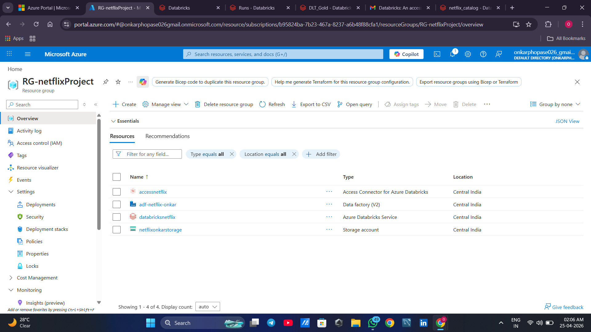

### ADLS Gen2 — All 4 Containers
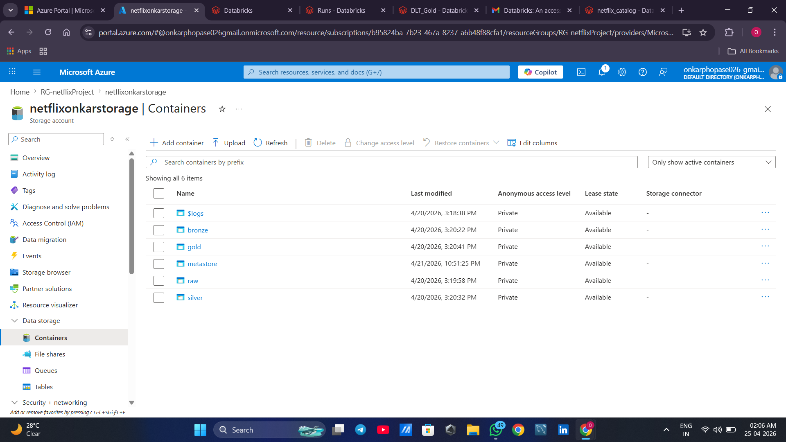

### ADF Pipeline Canvas — ForEach + Validation + Copy
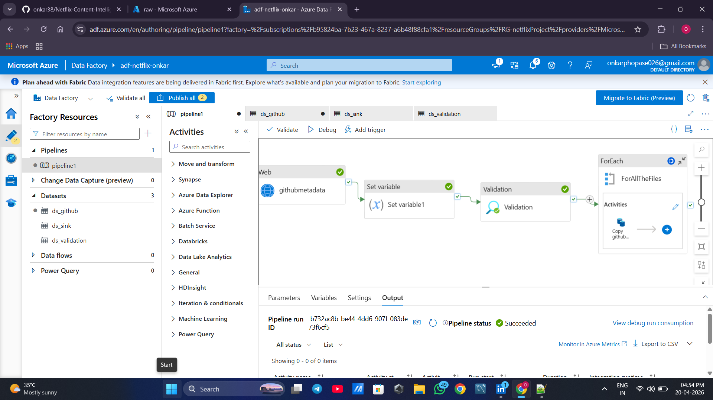

### ADF Successful Pipeline Runs
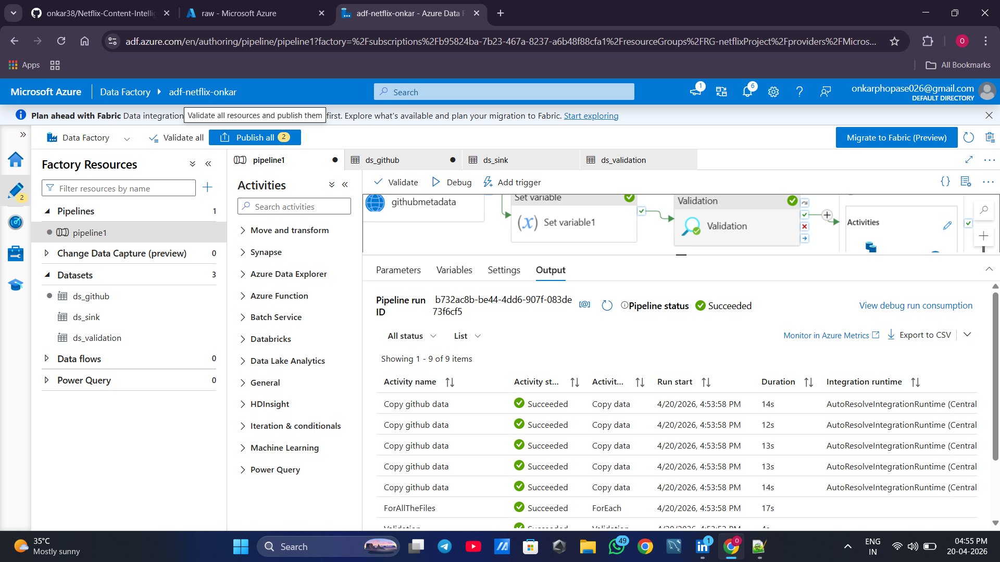

### Silver Notebook — PySpark Code + Visualization
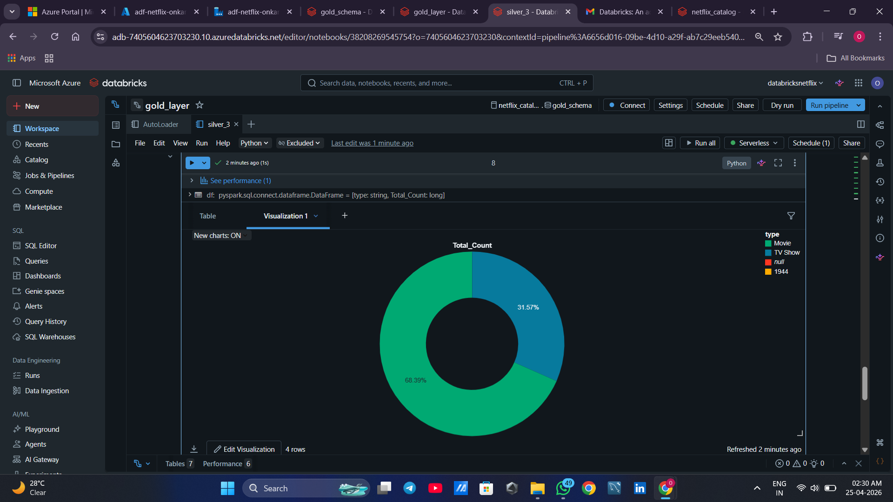

### Silver Layer — ForEach Job Running Live
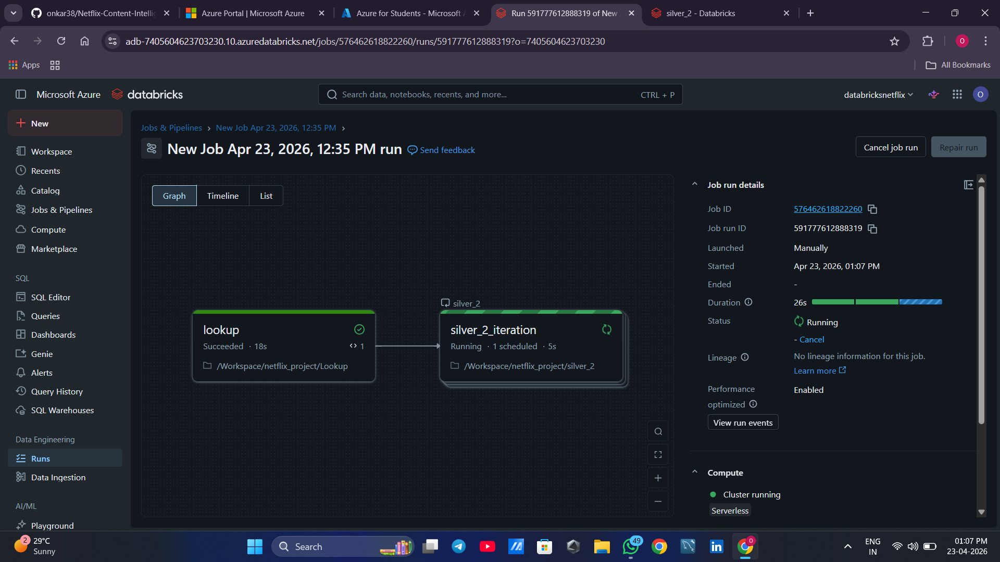

### Silver Layer — Conditional Weekday Job Graph View
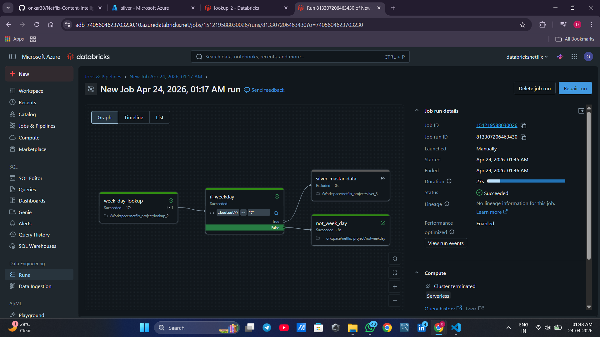

### Silver Layer — Conditional Weekday Job List View
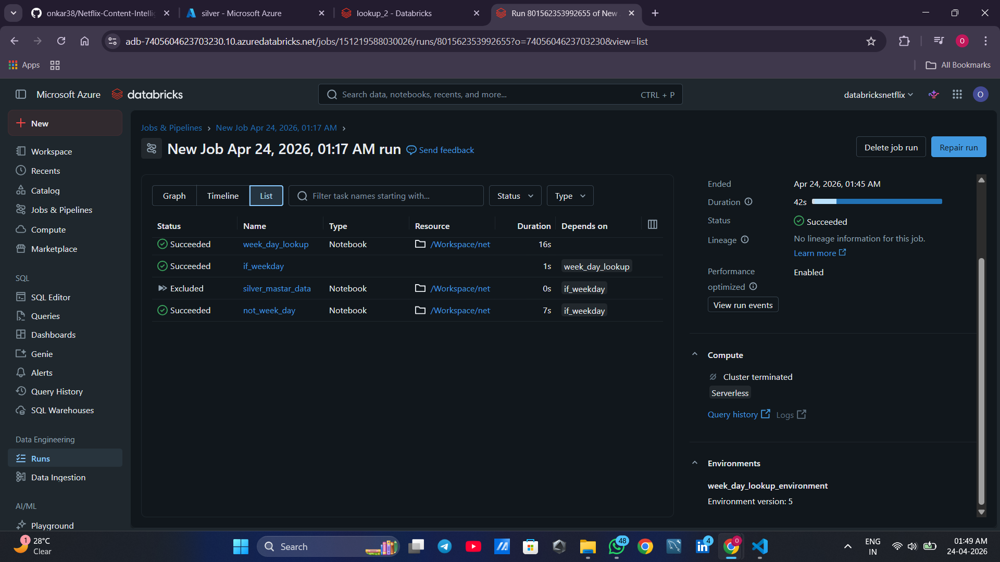

### Full Project Run History — Jobs & Pipelines
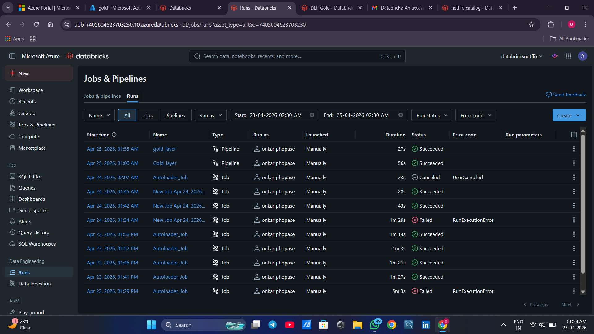

### Lakeflow ETL Pipeline Run — Green Lineage Flow
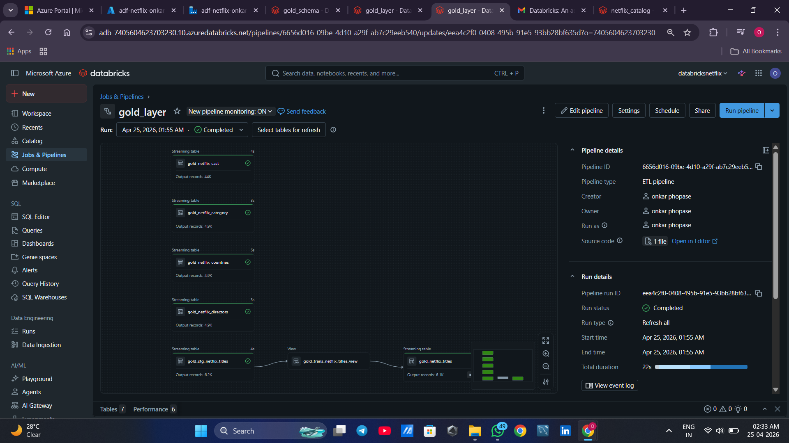

### Gold Tables in Unity Catalog
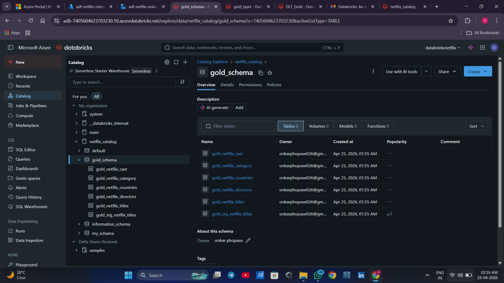

### Pipeline Tables with Expectations and Record Counts
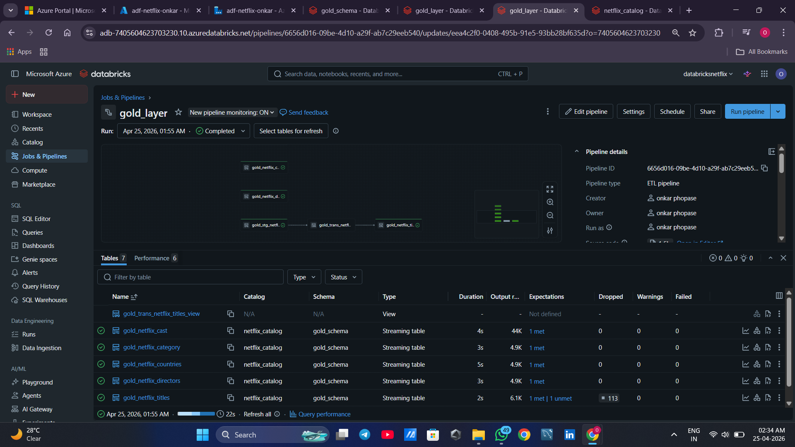
---

## 🎥 Demo Videos

| Video | Description |
|-------|-------------|
| [ADF Live Run](videos/adf_live_pipeline_run.mp4) | ADF pipeline triggered manually — green ticks appearing in real time |
| [Lakeflow Lineage Graph](videos/dlt_lineage_graph_zoom.mp4) | ETL pipeline lineage from staging → view → gold table |
| [Netflix Data Query](videos/sql_netflix_data_query.mp4) | Live SQL query on gold tables showing actual Netflix data |

---

## 🐛 Real Errors I Hit and Fixed

> These are **actual production-level errors** encountered during the build — not from tutorials.
> Each one reflects a scenario that data engineers face in enterprise pipelines every day.
> Understanding the *why* behind each error — not just the fix — is what separates a senior engineer from a junior one.

---

### ❌ Error 1 — `TEMP_CHECKPOINT_LOCATION_NOT_SUPPORTED`

**Where it happened:** Auto Loader Bronze layer — first run of streaming ingestion

**What broke:** Entire streaming job refused to initialize. Zero data ingested.

**Root cause:**
Unity Catalog enforces strict governance on all I/O operations. It does not permit Databricks to auto-generate temporary internal checkpoint paths because those paths exist outside Unity Catalog's lineage tracking scope. This is not a bug — it is a **deliberate Unity Catalog security and governance enforcement**. Any path that Unity Catalog cannot track is rejected at the job level before execution even begins.

**What a junior engineer does:**
Searches the error, finds a 2022 Stack Overflow answer for legacy Hive metastore, tries adding `.option("checkpointLocation", "")` — still fails. Spends an hour confused because the error message says "not supported" but doesn't say why.

**The actual fix:**
Every streaming job under Unity Catalog must have an explicit, fully-qualified ADLS Gen2 checkpoint path that Unity Catalog can govern.

```python
# WRONG — Unity Catalog rejects implicit/temp checkpoint paths
df.writeStream \
  .format("delta") \
  .start("abfss://bronze@netflixonkarstorage.dfs.core.windows.net/netflix_titles")

# CORRECT — explicit governed checkpoint path required
df.writeStream \
  .format("delta") \
  .option("checkpointLocation", "abfss://silver@netflixonkarstorage.dfs.core.windows.net/checkpoint/titles") \
  .outputMode("append") \
  .start("abfss://bronze@netflixonkarstorage.dfs.core.windows.net/netflix_titles")
```

**Real world relevance:**
Every company that has migrated to Unity Catalog has hit this. Engineers who know this rule become the go-to person when the team's streaming pipelines fail after a UC migration. Most candidates know the fix — knowing *why* UC rejects temp paths is what gets you hired at senior level.

---

### ❌ Error 2 — `STREAMING_OUTPUT_MODE.UNSUPPORTED_OPERATION`

**Where it happened:** Silver layer — trying to view streaming output during notebook development

**What broke:** Streaming query crashed immediately after starting. No output written, no error message that pointed to the actual cause.

**Root cause:**
`display()` is a Databricks convenience function built for interactive exploration with **batch DataFrames**. When called on a streaming DataFrame, it internally sets the output mode to **complete** — which requires the streaming engine to maintain the full dataset state in memory at all times. This directly conflicts with stateful streaming operations like Auto Loader, which are designed around **append mode** where only new records are processed per micro-batch.

Complete mode and append mode are architecturally incompatible in the same streaming query. Spark throws this error to prevent an operation that would require infinite memory growth.

**What a junior engineer does:**
Wraps everything in try-except thinking it is a transient error. Wonders why data is still not appearing. Restarts the cluster. Still fails.

**The actual fix:**

```python
# WRONG — display() silently enforces complete mode on streaming DataFrames
display(df)

# CORRECT — writeStream with explicit append mode
(df.writeStream
   .outputMode("append")
   .format("delta")
   .option("checkpointLocation", "abfss://silver@netflixonkarstorage.dfs.core.windows.net/checkpoint/titles")
   .trigger(processingTime="10 seconds")
   .start("abfss://silver@netflixonkarstorage.dfs.core.windows.net/netflix_titles"))
```

**Rule burned into memory after this error:**
`display()` → development, batch DataFrames, exploration only.
`writeStream` → any production streaming job, always, no exceptions.

**Real world relevance:**
This exact error gets introduced into production by junior engineers who test with `display()` and leave it in the notebook. In any company running 24/7 streaming pipelines, this is a production incident. Interviewers ask about Spark output modes specifically because this confusion is so widespread. Knowing the complete/append/update distinction cold is a baseline expectation for any Spark streaming role.

---

### ❌ Error 3 — `STREAMING_STATEFUL_OPERATOR_NOT_MATCH_IN_STATE_METADATA`

**Where it happened:** Re-running the Auto Loader job after modifying notebook logic mid-project

**What broke:** Job failed on restart despite previous runs being fully successful. The error appeared before any data was read.

**Root cause:**
Structured Streaming maintains a **state store** inside the checkpoint folder using RocksDB. This state store records the exact operator graph, schema, and processing offsets from the previous run. When you modify a streaming notebook — adding a column, changing a transformation, updating a schema — the new execution's operator graph does not match the structure stored in the checkpoint. Spark detects this mismatch before starting and refuses to resume, because resuming from an inconsistent state would produce corrupt or unpredictable output.

This is Spark protecting data integrity. It is the correct behavior.

**What a junior engineer does:**
Thinks the checkpoint is broken. Tries to recreate the notebook from scratch. Loses all offset tracking and reprocesses everything from the beginning unnecessarily. Or worse — tries to edit the RocksDB files directly.

**The actual fix:**
Delete the stale checkpoint. The job reprocesses from the beginning cleanly.

```python
# Delete stale checkpoint before rerunning after any schema or logic change
dbutils.fs.rm(
    "abfss://silver@netflixonkarstorage.dfs.core.windows.net/checkpoint",
    recurse=True
)
```

**Non-negotiable rule:**
Any time you change streaming job schema, operator logic, or transformations — delete the checkpoint first. Without exception.

**Real world relevance:**
In a real company, streaming pipelines run continuously. A schema change deployed without clearing the checkpoint causes the pipeline to crash at 3 AM. That is a production incident with an SLA breach. Engineers who understand checkpoint state management are the ones trusted to deploy streaming changes to production. Engineers who do not cause incidents.

---

### ❌ Error 4 — Silver Layer Failing on Delta-Format Bronze Files

**Where it happened:** Silver transformation notebook — reading lookup files from Bronze container

**What broke:** Silver notebook crashed immediately on read with a format mismatch error. Data was confirmed to exist in Bronze. The read operation simply refused to parse it.

**Root cause:**
The ADF pipeline writes lookup files (directors, cast, countries, category) from GitHub as **CSV format** to Bronze. But the Auto Loader notebook writes `netflix_titles` in **Delta format** to Bronze. Both types of files live in the same Bronze container. The silver notebook was hardcoded with `format("csv")` for all files — which worked for the four lookup tables but crashed the moment it tried to read the Delta-format titles file as CSV.

This is a **real architectural design mistake** that happens in production whenever a pipeline grows incrementally without a consistent format strategy from day one.

**What a junior engineer does:**
Creates two separate notebooks — one for CSV files, one for Delta files. Duplicates all the transformation logic. Doubles the maintenance burden. Next month when a new source is added in Parquet, they create a third notebook.

**The production-grade fix:**
Add `fileformat` as a first-class parameter in the lookup array. One notebook handles all formats dynamically. Zero duplication.

```python
# Lookup array — format is now a parameter, not an assumption
files = [
    {
        "source_folder": "netflix_directors",
        "target_folder": "netflix_directors",
        "fileformat": "csv"
    },
    {
        "source_folder": "netflix_titles",
        "target_folder": "netflix_titles",
        "fileformat": "delta"
    }
]

# Silver notebook reads format from widget — passed by ForEach loop
v_fileformat = dbutils.widgets.get("fileformat")

df = (spark.read
      .format(v_fileformat)
      .option("header", "true")
      .load(f"abfss://bronze@netflixonkarstorage.dfs.core.windows.net/{v_source_folder}"))
```

**Real world relevance:**
In enterprise pipelines, you never have just one file format. A single ingestion pipeline will receive CSV from one source, Parquet from an API, Delta from another internal team, and JSON from an event stream. Hardcoding format is a guarantee of future failures and duplicated code. Parameterizing format from day one is the production-grade approach. This exact pattern comes up in data engineering design interviews.

---

### ❌ Error 5 — NAT Gateway Silently Charging ₹2.50/Hour

**Where it happened:** Azure billing dashboard — discovered while reviewing cost management mid-project

**What broke:** Nothing in the pipeline broke. But the student subscription credit was draining at a continuous fixed rate — even with all compute terminated, all notebooks closed, and the workspace completely idle.

**Root cause:**
During Databricks workspace creation, the option **"No Public IP"** was enabled. This routes all Databricks cluster traffic through Azure's private network without exposing public IPs — a legitimate enterprise network security requirement. However, enabling it **automatically provisions a NAT Gateway** in the Databricks managed resource group. NAT Gateways are billed per hour of existence — not per usage, not per data transferred, not per cluster running. The meter runs the moment it is provisioned and stops only when deleted.

This is not a Databricks billing bug. It is documented Azure pricing behavior. The problem is that it is not prominently warned during workspace creation.

**What a junior engineer does:**
Terminates all clusters assuming that stops all billing. Comes back a week later to find significant unexpected charges with no obvious cause in the billing breakdown.

**The fix:**
Workspace-level networking settings cannot be changed post-creation. The only resolution:

```
1. Export all Databricks notebooks (File → Export → Source file)
2. Delete the Databricks workspace entirely
3. Recreate workspace with "No Public IP" disabled
4. ADLS Gen2 data is fully preserved — no data loss
5. ADF pipelines are fully preserved — no pipeline loss
6. Notebooks and Unity Catalog config need to be redone
```

**Prevention:**
Never enable "No Public IP" in a personal, student, or development workspace unless your organization's network security policy explicitly requires it. In enterprise environments, this setting is valid — but it is always accounted for in the cloud budget. In a student project, it provides no benefit and costs real money around the clock.

**Real world relevance:**
Cloud cost management is a core data engineering responsibility — not an optional skill. In any company, unexpected cloud spend triggers escalations, budget reviews, and sometimes performance conversations. Engineers who understand what provisions infrastructure, what bills at rest versus at usage, and how to audit their cloud spend are significantly more valuable than engineers who only understand the data layer.

---

## 💡 Key Concepts for Interviews

**Q: Why Auto Loader instead of regular batch read?**
Auto Loader uses directory listing with RocksDB checkpointing to track exactly which files have been processed. It guarantees exactly-once ingestion, handles schema evolution automatically, and scales to millions of files without any manual file tracking or offset management. Batch reads require you to track processed files yourself — that is error-prone at scale.

**Q: What are the three Lakeflow SDP expectation failure modes?**
- `expect` (warn) — records the violation in pipeline metrics but keeps the data. Use for monitoring and alerting.
- `expect_or_drop` — silently drops violating records, pipeline continues with clean data. Use for optional enrichment fields.
- `expect_or_fail` — fails the entire pipeline if any single record violates the rule. Use for primary keys and non-nullable business-critical fields.

**Q: Difference between streaming table and materialized view in Lakeflow SDP?**
Streaming table processes only new incremental data since the last checkpoint — designed for append-only sources. Materialized view recomputes from query logic and supports full refreshes — designed for aggregations over a full dataset. You choose based on whether your source is append-only or whether the output needs full recomputation.

**Q: Why parameterized notebooks instead of static?**
In real world, source and target paths change per environment (dev/test/prod), per table, and per business requirement. Hardcoding makes the notebook single-purpose and unmaintainable. Using `dbutils.widgets` + Jobs & Pipelines ForEach, one notebook handles all tables across all environments dynamically. One file to maintain instead of N copies.

**Q: What is the Access Connector and why is it needed?**
Access Connector is an Azure managed identity resource dedicated to Databricks. It holds RBAC permissions (Storage Blob Data Contributor) on ADLS Gen2. Databricks uses it to read and write data without any credentials in code — no service principals, no SAS tokens, no secrets to rotate or accidentally expose.

**Q: What is Unity Catalog and why does it matter in 2026?**
Unity Catalog is Databricks' centralized governance layer providing fine-grained access control at catalog/schema/table/column level, full data lineage tracking, table discovery, and audit logging across all workspaces in an organization. In 2026 it is the mandatory approach — legacy Hive metastore is being deprecated. Any company on Databricks is either on Unity Catalog or actively migrating to it.

**Q: What changed in Databricks in 2026 that every engineer must know?**
Delta Live Tables was rebranded to **Lakeflow Spark Declarative Pipelines (SDP)**. The Workflows tab became **Jobs & Pipelines**. ETL pipelines are created under Jobs & Pipelines → ETL pipeline. The `import dlt` code and `@dlt.table` syntax are unchanged — only UI and product naming changed. Engineers who know the current UI avoid wasting time searching for removed tabs.

---

## 📊 Project Stats

| Metric | Value |
|--------|-------|
| Source files processed | 5 CSV files |
| Medallion layers | 3 (Bronze, Silver, Gold) |
| Gold tables created | 6 |
| Technologies used | 9 |
| Parameterized pipelines | 100% |
| Hardcoded values | 0 |
| Real production errors debugged | 5 |
| Data quality rules applied | All Gold tables |
| Bad records auto-dropped by expectations | Yes |
| Cost optimized | Yes — explicit cluster termination + no NAT Gateway |

---

## 🚀 How to Replicate This Project

### Prerequisites
- Azure account (free tier or student subscription)
- Basic Python / PySpark knowledge
- Basic SQL knowledge

### Step 1 — Azure Infrastructure
```
1. Create Resource Group
2. Create ADLS Gen2 storage account — enable Hierarchical Namespace ON
3. Create 4 containers: raw, bronze, silver, gold
4. Create Azure Data Factory instance
5. Create Databricks workspace — Premium tier, No Public IP = DISABLED
6. Create Access Connector for Databricks
7. Assign Storage Blob Data Contributor role to Access Connector on storage account
```

### Step 2 — Unity Catalog Setup
```
1. Go to Databricks Account Console
2. Create Unity Catalog metastore — match workspace region exactly
3. Create a dedicated metastore container in storage account
4. Assign Access Connector to metastore
5. Link workspace to metastore
6. Create catalog: netflix_catalog
7. Create external locations for bronze, silver, gold containers
8. Grant USE CATALOG, CREATE SCHEMA, USE SCHEMA permissions
```

### Step 3 — ADF Pipeline
```
1. Create linked services: HTTP (GitHub anonymous) + ADLS Gen2
2. Create parameterized datasets for source and sink
3. Build ForEach pipeline with parallel copy activity
4. Add validation pipeline with file existence check
5. Publish and trigger
```

### Step 4 — Databricks Notebooks (Silver)
```
1. Run 1_autoloader_bronze.py — Auto Loader incremental ingestion
2. Run 2_silver_lookup.py — builds lookup array and exposes via task values
3. Create Job in Jobs & Pipelines with ForEach loop
4. Configure task parameters: source_folder, target_folder, fileformat
5. Run 3_silver_transformation.py via job
```

### Step 5 — Gold Layer (Lakeflow Spark Declarative Pipelines)
```
1. Go to Jobs & Pipelines → Create new → ETL pipeline
2. Select netflix_catalog → gold_schema
3. Add existing assets → select notebook 4_dlt_gold.py
4. Set compute to Small cluster
5. Run pipeline
6. Verify all gold tables in Catalog Explorer under netflix_catalog → gold_schema
7. Check expectations tab for dropped record counts and data quality metrics
```

---

## 📝 Lessons Learned

> These are not generic tips copied from a tutorial. Every point below cost real time and real credit on this project.

1. **Explicit checkpoint paths are mandatory with Unity Catalog** — Unity Catalog tracks lineage on all I/O. Implicit temp checkpoints are outside its governance scope and will always be rejected at job startup. This is by design.

2. **`display()` is a development tool, not a production streaming operator** — It defaults to complete output mode internally. It will break any stateful streaming job. Remove it before any production run, always.

3. **Stale checkpoints must be deleted before rerunning after any logic change** — The RocksDB state store from the old run will not match the new operator graph. Delete checkpoint directory first. No exceptions.

4. **Parameterize file format from day one** — Bronze layer will have mixed formats across sources. Hardcoding `format("csv")` is a future failure guaranteed. Add format as a parameter to your lookup array from the start.

5. **"No Public IP" in Databricks provisions a NAT Gateway** — It bills per hour of existence regardless of any usage. Check your cost management dashboard at least weekly during any cloud project. Surprises show up on weekends.

6. **Unity Catalog setup is the hardest part no tutorial explains fully** — Access Connector, metastore creation, external locations, schema permissions — all must happen in the right order. One wrong step blocks everything downstream.

7. **Databricks rebrands products faster than tutorials update** — Delta Live Tables is now Lakeflow Spark Declarative Pipelines (SDP). Workflows is now Jobs & Pipelines. If you cannot find a feature in the UI, check the release notes before assuming it was removed.

8. **Serverless compute over personal compute clusters for cost control** — Personal compute clusters bill per minute they are alive, even while idle. Serverless bills only during active execution. For a student subscription this difference compounds fast.

9. **`dbutils.jobs.taskValues` is how notebooks communicate within a job** — Without it, your ForEach loop has no dynamic data to iterate over. It is the backbone of every parameterized multi-notebook pipeline.

10. **Debug ADF pipelines before publishing, every time** — Every publish deploys changes permanently to all connected environments. Debug mode runs in isolation and catches variable type mismatches, missing parameters, and connection errors before they become production failures.

---

## 🔗 References

- [Azure Data Factory Documentation](https://docs.microsoft.com/en-us/azure/data-factory/)
- [Databricks Auto Loader Documentation](https://docs.databricks.com/ingestion/auto-loader/index.html)
- [Lakeflow Spark Declarative Pipelines (formerly DLT)](https://docs.databricks.com/aws/en/ldp/where-is-dlt)
- [Unity Catalog Documentation](https://docs.databricks.com/data-governance/unity-catalog/index.html)
- [Delta Lake Documentation](https://docs.delta.io/latest/index.html)
- [Databricks Jobs & Pipelines Documentation](https://docs.databricks.com/workflows/index.html)


---

## 👤 Author

**Onkar Phopase**
Data Engineering | Azure | Databricks | PySpark

[](https://www.linkedin.com/in/onkar-phopase/)
[](https://github.com/onkar38)

---

> ⭐ If this project helped you, give it a star — it helps others find it.
>
> 💬 Open to Data Engineering roles — feel free to connect on LinkedIn.
